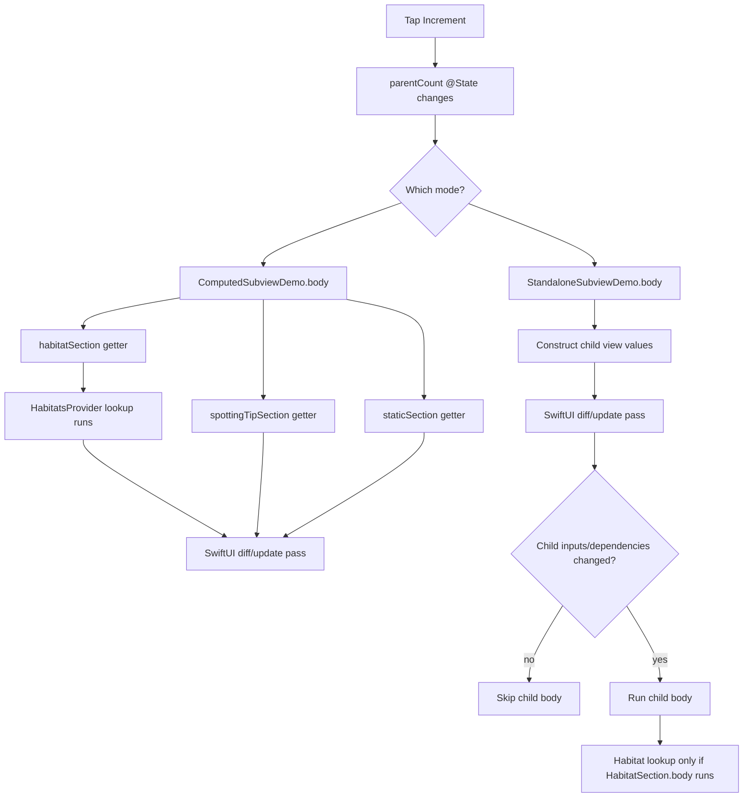

# SwiftUI Rendering Example

This repository contains the `SwiftSubviewIdentityDemo` iOS app. It compares
SwiftUI private computed `some View` properties with standalone child `View`
structs during parent state updates.

## Project Layout

```text
SwiftSubviewIdentityDemo.xcodeproj
SwiftSubviewIdentityDemo/
  ComputedSubviewDemo.swift
  StandaloneSubviewDemo.swift
  Models.swift
  SharedViews.swift
  DemoRootView.swift
project.yml
```

Open `SwiftSubviewIdentityDemo.xcodeproj` in Xcode and run the
`SwiftSubviewIdentityDemo` scheme. The app has two modes:

- **Computed**: sections are private computed `some View` properties on the
  parent view.
- **Standalone**: the same sections are standalone child `View` structs.

The debug console logs `_printChanges()` output and explicit work markers.

## Core Lesson

SwiftUI has two phases that are easy to mix together:

1. Swift code builds view values.
2. SwiftUI compares those values and decides which view bodies to ask for.

A computed property or helper function does not create a child body boundary.
It is just parent body code moved elsewhere.

```swift
@ViewBuilder
private var habitatSection: some View {
    if let name = HabitatsProvider.habitatName(for: animal.habitatID) {
        DemoSection(title: "Habitat", badge: "@ViewBuilder private var", systemImage: "leaf") {
            Text(name)
        }
    }
}
```

The provider lookup above is parent-body work. If the parent body runs, this
computed property runs.

A standalone child view creates a separate body boundary:

```swift
private struct HabitatSection: View {
    let animal: Animal

    var body: some View {
        if let name = HabitatsProvider.habitatName(for: animal.habitatID) {
            DemoSection(title: "Habitat", badge: "standalone View", systemImage: "leaf") {
                Text(name)
            }
        }
    }
}
```

Now the lookup is child-body work. SwiftUI can skip that child body when the
child's inputs and dependencies did not change.

## Increment Button Behavior

In **Computed** mode, tapping increment changes `parentCount`, so
`ComputedSubviewDemo.body` runs. The body references all three computed
properties:

```swift
habitatSection
spottingTipSection
staticSection
```

Expected repeated logs:

```text
ComputedSubviewDemo: _parentCount changed.
[SubviewIdentityDemo] ComputedSubviewDemo.habitatSection evaluated
[SubviewIdentityDemo] HabitatsProvider.habitatName(for:) searched
[SubviewIdentityDemo] ComputedSubviewDemo.spottingTipSection evaluated
[SubviewIdentityDemo] ComputedSubviewDemo.staticSection evaluated
```

The unrelated habitat lookup still runs because it lives in a parent computed
property.

In **Standalone** mode, tapping increment changes `parentCount` on the parent,
but `HabitatSection`, `SpottingTipSection`, and `StaticSection` are child body
boundaries. Their bodies can be skipped when their inputs did not change.

Expected repeated logs:

```text
StandaloneSubviewDemo: _parentCount changed.
```

You should not repeatedly see:

```text
[SubviewIdentityDemo] HabitatSection.body evaluated
[SubviewIdentityDemo] HabitatsProvider.habitatName(for:) searched
[SubviewIdentityDemo] StaticSection.body evaluated
```

## Toggle Behavior

Both demos keep `showsSpottingTip` as parent-owned state.

In the standalone version, the parent passes a binding:

```swift
SpottingTipSection(
    animal: animal,
    showsSpottingTip: $showsSpottingTip
)
```

Passing `$showsSpottingTip` is not the same as reading `showsSpottingTip` in the
parent body. The value is read inside `SpottingTipSection.body`, so toggling the
switch can update only that child body:

```text
SpottingTipSection: _showsSpottingTip changed.
[SubviewIdentityDemo] SpottingTipSection.body evaluated
```

In the computed version, the toggle is inside a parent computed property, so the
parent body and all computed sections are evaluated again:

```text
ComputedSubviewDemo: _showsSpottingTip changed.
[SubviewIdentityDemo] ComputedSubviewDemo.habitatSection evaluated
[SubviewIdentityDemo] HabitatsProvider.habitatName(for:) searched
[SubviewIdentityDemo] ComputedSubviewDemo.spottingTipSection evaluated
[SubviewIdentityDemo] ComputedSubviewDemo.staticSection evaluated
```

## Approximate Call Paths

### Computed Property

```text
Button action
-> parentCount mutates
-> ComputedSubviewDemo invalidated
-> ComputedSubviewDemo.body
-> habitatSection getter
-> HabitatsProvider.habitatName(for:)
-> spottingTipSection getter
-> staticSection getter
-> SwiftUI diff/update pass
```

### Standalone Child View

```text
Button action
-> parentCount mutates
-> StandaloneSubviewDemo invalidated
-> StandaloneSubviewDemo.body
-> HabitatSection(animal:) value constructed
-> SpottingTipSection(animal:showsSpottingTip:) value constructed
-> StaticSection() value constructed
-> SwiftUI diff/update pass
-> unchanged child bodies skipped
```

The child view values may still be constructed as cheap descriptions. The
important difference is that SwiftUI can skip their `body` work.

## Rendering Graph



## Practical Rule

- Keep computed `some View` properties tiny and cheap.
- Use standalone child `View` structs for meaningful sections.
- Pass small inputs, bindings, and callbacks into child views.
- Put expensive derived work behind a child `body` boundary or cache it outside
  the view lifecycle.
- Keep SwiftUI view initializers cheap; initializer work is plain Swift
  construction work and is not protected by body diffing.
